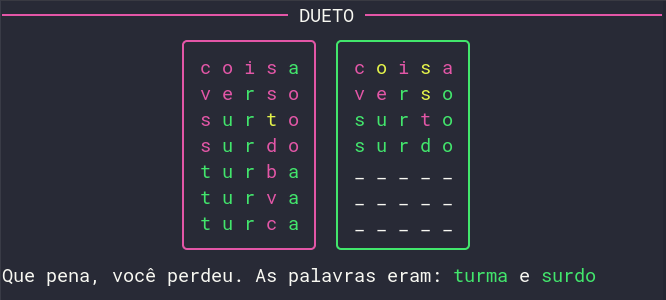

# Letreco CLI
 Este é um jogo para terminal baseado no [Wordle][link-wordle], [Termo][link-termo] e [Letreco][link-letreco].

## Instalação
Instale com pip ou seu gerenciador de pacotes PyPI favorito.
```sh
pip install letreco # not implemented
```

## Executando o jogo
Execute o seguinte comando no seu terminal:
```sh
letreco # not implemented
```

---

No **Termo** você deve acertar uma palavra em **6** tentativas. No **Dueto** são duas palavras em **7** tentativas.

A palavra sempre terá 5 letras, e será gerada de forma aleatória a partir de uma lista preestabelecida.

Depois de cada tentativa, as letras recebem cores para mostrar o quão perto você está da solução.
Somente palavras existentes são aceitas por tentativa.

>Caso a letra fique **vermelha**, significa que ela **não faz parte da solução**.

>Caso a letra fique **verde**, significa que ela **faz parte da solução e está na posição correta**.

>Caso a letra fique **amarela**, siginifica que ela **faz parte da solução porém em outra posição**.

As palavras podem possuir letras repetidas.
Ao observar as cores das letras você pode verificar se uma mesma letra se repete na palavra ou não.

Os acentos são preenchidos automaticamente e não são considerados nas dicas.
<div align="center">


</div>

<div align="center">


</div>

<div align="center">


</div>

<div align="center">


</div>

<div align="center">


</div>

<div align="center">



</div>

## Como funciona
As palavras selecionadas para as partidas foram escolhidas manualmente por mim, e em cada início de partida uma nova palavra é escolhida aleatoriamente.

Para verificar se a palavra existe ou não, filtrei uma lista publica de palavras que pode ser encontrada [aqui][link-palavras], e coloquei essas palavras em um database, com cada palavra acentuada e desacentuada.

Para verificar a existência de cada palavra realizei requests no [dicio.com][link-dicio], onde fiz um script em python para automatizar o processo.

[link-wordle]: https://www.nytimes.com/games/wordle/index.html
[link-termo]: https://term.ooo/
[link-letreco]: https://www.gabtoschi.com/letreco/
[link-palavras]: https://github.com/fserb/pt-br
[link-dicio]: https://www.dicio.com.br/